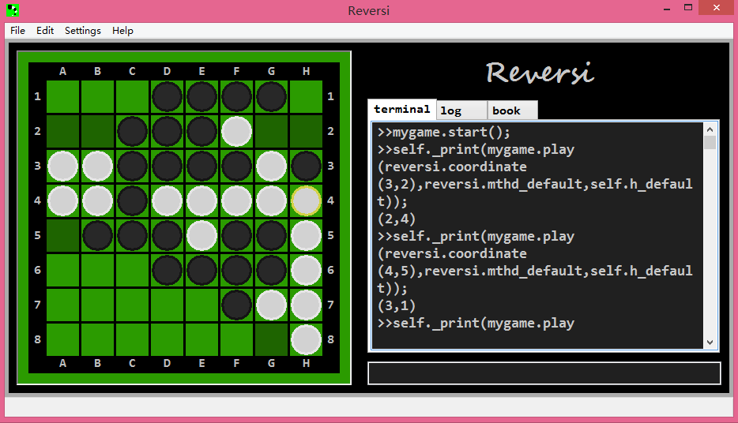

## Reversi

### Screenshot

### Overview
Reversi (also called Othello) is a kind of strategy board game which involves play by two parties on an eight-by-eight square grid. For details of reversi please go to [https://en.wikipedia.org/wiki/Reversi](https://en.wikipedia.org/wiki/Reversi).

This reversi project is my simple work. The kernel is written in C++11 whith a bit inline assembly. The GUI is witten in python. The sources of this project can be merged in to a single file and submitted to [Botzone](https://botzone.org) which is a online platform for competition of differnt bots made by students and other programming learners.

### Download
Here are prebuilt binaries. Download and extract one to the subdirectory python/ .  
	[library for Windows 64-bit](https://github.com/Nugnikoll/MyReversi/releases/download/untagged-20c3c432273701ae53ef/reversi_windows_x64.zip)  
	[library for Windows 64-bit which supports BMI2 instruction set](https://github.com/Nugnikoll/MyReversi/releases/download/untagged-20c3c432273701ae53ef/reversi_windows_x64_bmi2.zip)  
	[library for Linux 64-bit](https://github.com/Nugnikoll/MyReversi/releases/download/untagged-20c3c432273701ae53ef/reversi_linux_x64.tar.gz)  
	[library for Linux 64-bit which supports BMI2 instruction set](https://github.com/Nugnikoll/MyReversi/releases/download/untagged-20c3c432273701ae53ef/reversi_linux_x64_bmi2.tar.gz)

### Build

- Prerequisites
	- A decent C++ compiler  
		C++11 must be supported by this compiler. Inline assembly will not be used when compiled by Visual Studio as MS compiler supports neither 64-bit inline assembly nor AT&T flavor syntax.
	- [Python3](https://www.python.org/)
	- [swig](http://swig.org/)
	- [wxPython](https://www.wxpython.org/)
	- [numpy](http://www.numpy.org/)
	- [CMake](https://cmake.org/)

- Build the library for reversi  
	Compile the source code and generate dynamic link library (_reversi.so or _reversi.pyd)  
	`cd build`  
	`cmake -DCMAKE_BUILD_TYPE=RELEASE
.` (To generate MinGW Makefiles on windows, it should be `cmake -G"MinGW Makefiles"  -DCMAKE_BUILD_TYPE=RELEASE .`)  
	`make`  
	`cd ..`  

- Generate source file for [Botzone](https://botzone.org)
	1. Enter the directory botzone/  
		`cd botzone`
	2. Merge sources into a single file "main_merge.cc"  
		`python3 merge.py`

### Usage
- Prerequisites
	- [Python3](https://www.python.org/)
	- [wxPython](https://www.wxpython.org/)
	- [numpy](http://www.numpy.org/)
	- library _reversi.so or _reversi.pyd (should be downloaded here or built from source)

- Execute the main program  
	`cd python`  
	`python3 main.py` 

### Development

- File Structure  

		cpp/reversi.h: class board
		│	cpp/flip.cc board::flip()
		│	cpp/reversi.cc
		│	cpp/search.cc board::search()
		│	...
		│
		└───python/game.py: class game
		│		│
		│		└───python/main.py (python GUI project)
		│
		└───botzone/main.cc (Botzone online project)

- Profile (only available on UNIX-like systems)
	- Prerequisites
		- [graphiz](https://www.graphviz.org/)
		- [gprof2dot](https://github.com/jrfonseca/gprof2dot)

	1. Enter the directory profile/  
		`cd profile`
	2. Compile the source code and generate files "prof.log" "test.png"  
		`make`
