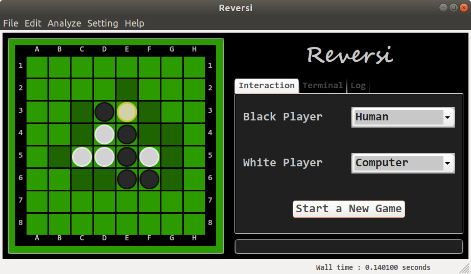

## Reversi

### Screenshot

### Overview
Reversi (also called Othello) is a kind of strategy board game which involves play by two parties on an eight-by-eight square grid. For details of reversi please go to [https://en.wikipedia.org/wiki/Reversi](https://en.wikipedia.org/wiki/Reversi).

This reversi project is my simple work. The kernel is written in C++11 whith a bit inline assembly. The GUI is witten in python. It's open source and cross platform. I've managed to build it on Ubuntu and on Windows with MinGW g++ compiler. It's tailored for programming learning. To ease debugging and trainning, many C++ functions are wrapped and can be called interactively in the Python GUI application. The sources of this project can be merged in to a single file and submitted to [Botzone](https://botzone.org) which is a online platform for competition of differnt bots made by other students. The Python GUI application can also act as a judge by communicating with other reversi program in json format.

### Download
[prebuilt binaries for Windows 64-bit](https://github.com/Nugnikoll/MyReversi/releases/download/v2.3/reversi_windows_x86_64.zip) 

### Build

- Prerequisites
	- A decent C++ compiler  
		C++11 must be supported by this compiler. g++, mingw32-g++ and clang++ are suggested. Inline assembly will not be used when compiled by Visual Studio as MS compiler supports neither 64-bit inline assembly nor AT&T flavor syntax.
	- [Python3](https://www.python.org/)
	- [Swig](http://swig.org/) >= 3.0.6
	- [NumPy](http://www.numpy.org/)
	- [CMake](https://cmake.org/) >= 3.14
	- [wxPython](https://www.wxpython.org/)  
	- [IPython](https://ipython.org/)
	Please make sure that the directory of python3, swig and cmake has been appended to the environment variable PATH.

- Build the library for reversi  
	Compile the source code and generate dynamic link library (_reversi.so or _reversi.pyd)  
	`cd build`  
	`cmake -DCMAKE_BUILD_TYPE=RELEASE .` (DO NOT OMIT THE TRAILING DOT. To generate MinGW G++ Makefiles on windows, it should be `cmake -G"MinGW Makefiles" -DCMAKE_BUILD_TYPE=RELEASE .`)  
	`make`  
	`cd ..`  

- Generate source file for [Botzone](https://botzone.org)
	1. Enter the directory botzone/  
		`cd botzone`
	2. Merge sources into a single file "main_merge.cc"  
		`python3 merge.py`

### Usage

- If you have downloaded the prebuilt binaries, extract them and double click on reversi.exe .
- If you have built the binaries from source, enter the directory app/ and execute the main program.  
	`cd app`  
	`python3 main.py`  

### Development

- File Structure  

		cpp/board.h: class board
		│	cpp/board.cc
		│	cpp/flip.cc board::flip()
		│	cpp/search.cc board::search()
		│	...
		│
		└───app/game.py: class game
		│		│
		│		└───app/main.py (python GUI project)
		│
		└───botzone/main.cc (Botzone online project)

- Training  
	Besides the dependencies metioned before, [SciPy](https://www.scipy.org/) is also required here. To train with random self-play games, simply enter the directory python/ and execute the script pattern_optimize.py .  
	`cd app`  
	`python3 pattern_optimize.py`  
	If you want to perform training with custom parameters, type `python3 pattern_optimize.py --help` for help.

- Profile (only available on UNIX-like systems)
	- Prerequisites
		- [graphiz](https://www.graphviz.org/)
		- [gprof2dot](https://github.com/jrfonseca/gprof2dot)

	1. Enter the directory profile/  
		`cd profile`
	2. Compile the source code and generate files "prof.log" "test.png"  
		`make`
