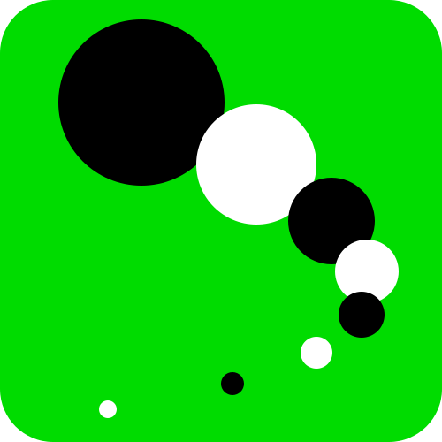

##Reversi

###Screenshot

###Overview
Reversi (also called Othello) is a kind of strategy board game which involves play by two parties on an eight-by-eight square grid. For detail of reversi please go to [https://en.wikipedia.org/wiki/Reversi](https://en.wikipedia.org/wiki/Reversi).

This reversi project is my simple work. The kernel is written in C++11 whith a bit inline assembly. Script language python and tcl can be embeded to ease the interaction with users. The GUI is built with wxwidgets. It can be written in C++ or python. The sources of this project can be merged in to a single file and submitted to [Botzone](https://botzone.org) which is a online platform for competetion of differnt bots made by students and other programming learners.

###Compilation

- Prerequisites
	- Essential
		- gcc compiler (Note: C++11 must be supported by this version of gcc. It cannot be compiled by Visual Studio as MS compiler supports neither 64-bit inline assemby nor AT&T flavor syntax. I'm not sure whether other compilers like Clang++ works or not.)
	- Optional
		- CodeBlocks or Cbp2make (if you want to utilize the .cbp codeblocks project file to build this project)
		- TCL (if you want to embed tool command language)
		- cpptcl (if you want to embed tool command language)
		- wxWidgets (required by the GUI version written in C++)
		- python3 (required by the GUI version written in Python and some simple scripts)
		- wxPython (required by the GUI version written in Python)

###Development

	class board
	│	flip()
	│	search()    
	│	...
	│
	└───class game
	│	│
	│	└───reversi_tcl
	│	│	│
	│	│	└───main.cc (C++ tcl console project)
	│	│	│
	│	│	└───reversi_gui
	│	│		│
	│	│		└───reversi_guiFrame (C++ tcl GUI project)
	│	│
	│	└───reversi_gui.py
	│		│
	│		└───main.py (python GUI project)
	│
	└───main_json (Botzone online project)
